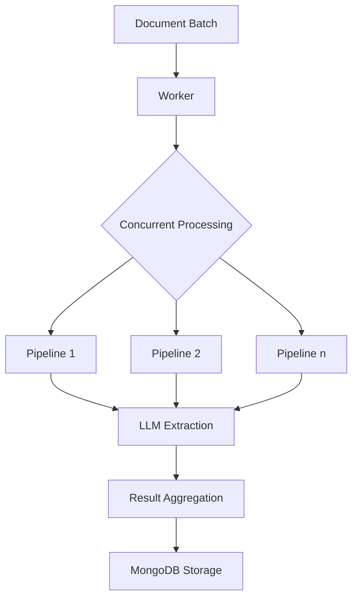

# Document Processing Pipeline

A high-performance, distributed document processing system written in Go that leverages OpenAI's language models for intelligent text extraction and analysis. The system implements a robust pipeline architecture with load balancing, health monitoring, and graceful error handling.

## 🚀 Features

- **Distributed Processing**: Concurrent document processing with configurable worker pools
- **Load Balanced LLM Integration**: Multi-server OpenAI client with automatic failover and health checks
- **Advanced Search**: Integration with MeiliSearch for efficient document querying
- **Persistent Storage**: MongoDB for document and pipeline management
- **Queue Management**: Redis-based work queue for batch processing
- **Graceful Shutdown**: Managed service shutdown with timeout controls
- **Robust Logging**: Colored, structured logging with different severity levels
- **Health Monitoring**: Automatic health checks and server status tracking
- **Resource Management**: Semaphore-based concurrency control

## 🏗 Architecture

### Core Components

1. **FileService**: Main orchestrator managing document processing
   - Handles concurrent document processing
   - Manages extraction pipelines
   - Controls resource allocation

2. **LoadBalancedOpenAIClient**: Distributed LLM processing
   - Multiple server support
   - Automatic health checks
   - Round-robin load balancing
   - Failover handling

3. **Worker**: Background processing engine
   - Continuous batch processing
   - Graceful shutdown support
   - Error recovery

4. **Repositories**:
   - `FileRepository`: Document management
   - `PipelineRepository`: Pipeline configuration
   - `SearchService`: Document search operations

## 🔧 Technical Specifications

### Dependencies

```go
require (
    "github.com/go-redis/redis/v8"
    "github.com/joho/godotenv"
    "github.com/meilisearch/meilisearch-go"
    "github.com/sashabaranov/go-openai"
    "go.mongodb.org/mongo-driver/mongo"
)
```

### Configuration

```go
type Config struct {
    MaxConcurrentDocuments   int
    MaxConcurrentExtractions int
    ExtractionTimeout        time.Duration
    ShutdownTimeout          time.Duration
}
```

### Environment Variables

Required environment variables:
- `NEBUIA_LLM_KEY`: OpenAI API key
- `MONGO_URI`: MongoDB connection string
- `MONGO_DB`: MongoDB database name
- `MEILI_HOST`: MeiliSearch host
- `MEILI_KEY`: MeiliSearch API key
- `REDIS_HOST`: Redis host
- `REDIS_PORT`: Redis port
- `REDIS_PASSWORD`: Redis password

## 🔄 Processing Pipeline

### Document Flow

1. Documents enter the system via Redis queue
2. Worker picks up batches for processing
3. Documents are processed concurrently within configured limits
4. Each document goes through multiple extraction pipelines
5. Results are stored in MongoDB
6. Search index is updated via MeiliSearch

### Extraction Process



## 🛠 Usage

### Starting the Service

```go
func main() {
    // Initialize services
    fileService := NewFileService(fileRepo, pipelineRepo, searchClient)
    worker := NewWorker(fileService)

    // Start processing
    worker.Start()
}
```

### Pipeline Configuration

Pipelines are configured in MongoDB with the following structure:

```json
{
    "name": "pipeline_name",
    "key": "extraction_key",
    "value": "extraction_value",
    "match": "search_pattern",
    "schema": "extraction_schema",
    "use_llama": false
}
```

## ⚡ Performance Considerations

- Configurable concurrency limits for document processing
- Semaphore-based extraction control
- Timeout management for LLM requests
- Health monitoring with automatic server exclusion
- Resource cleanup during shutdown

## 🔒 Error Handling

The system implements comprehensive error handling:
- Pipeline processing errors
- Database connection issues
- LLM extraction failures
- Search query errors
- Queue management errors

Each error is logged with appropriate severity and context.

## 🚦 Health Monitoring

The system continuously monitors:
- LLM server health
- Database connectivity
- Redis queue status
- Worker state
- Pipeline performance

## 📊 Logging

Structured logging with severity levels:
- INFO: General operational information
- WARNING: Potential issues
- ERROR: Processing failures
- DEBUG: Detailed operational data
- SUCCESS: Completion notifications
- CRITICAL: System-level issues

## 🔍 Metrics

The system tracks:
- Document processing time
- Pipeline execution duration
- Extraction success rates
- Server health status
- Queue length
- Concurrent operations

## 💻 Development

### Prerequisites

- Go 1.19+
- MongoDB
- Redis
- MeiliSearch
- OpenAI API access

### Local Setup

1. Clone the repository
2. Copy `.env.example` to `.env`
3. Configure environment variables
4. Run `go mod download`
5. Start the service with `go run main.go`

## 🤝 Contributing

1. Fork the repository
2. Create a feature branch
3. Commit changes
4. Push to the branch
5. Create a Pull Request

## 📝 License

[MIT License](LICENSE)